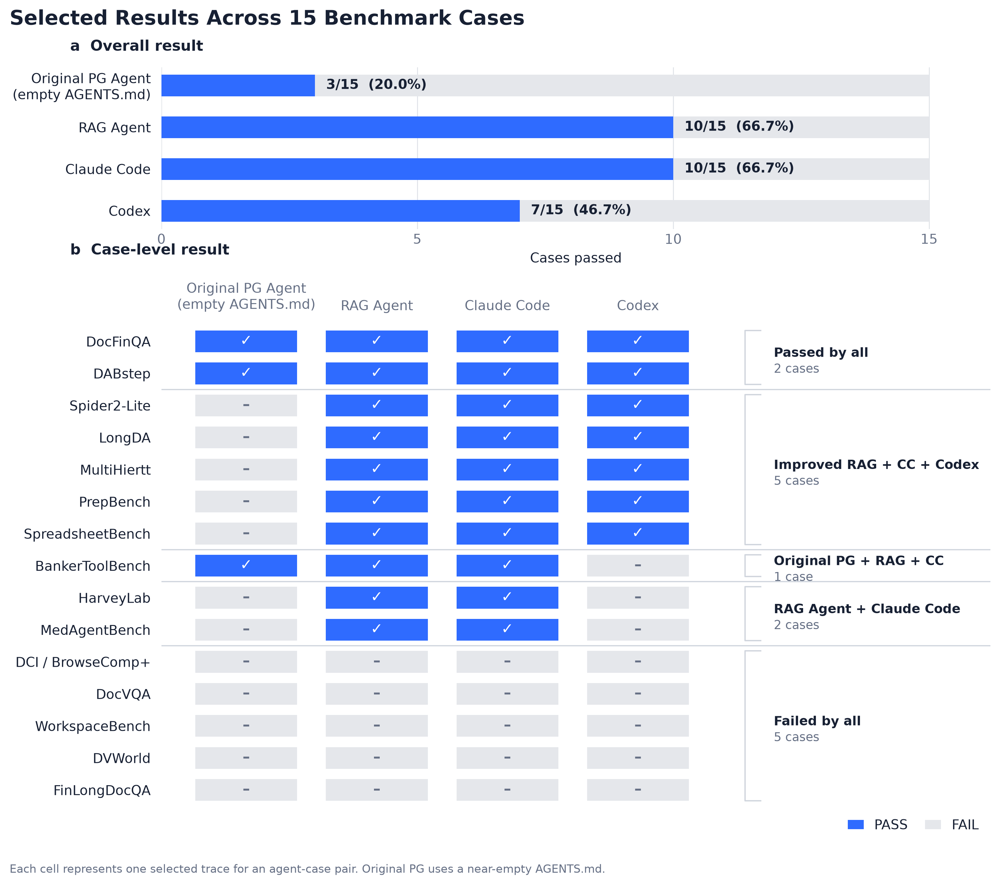
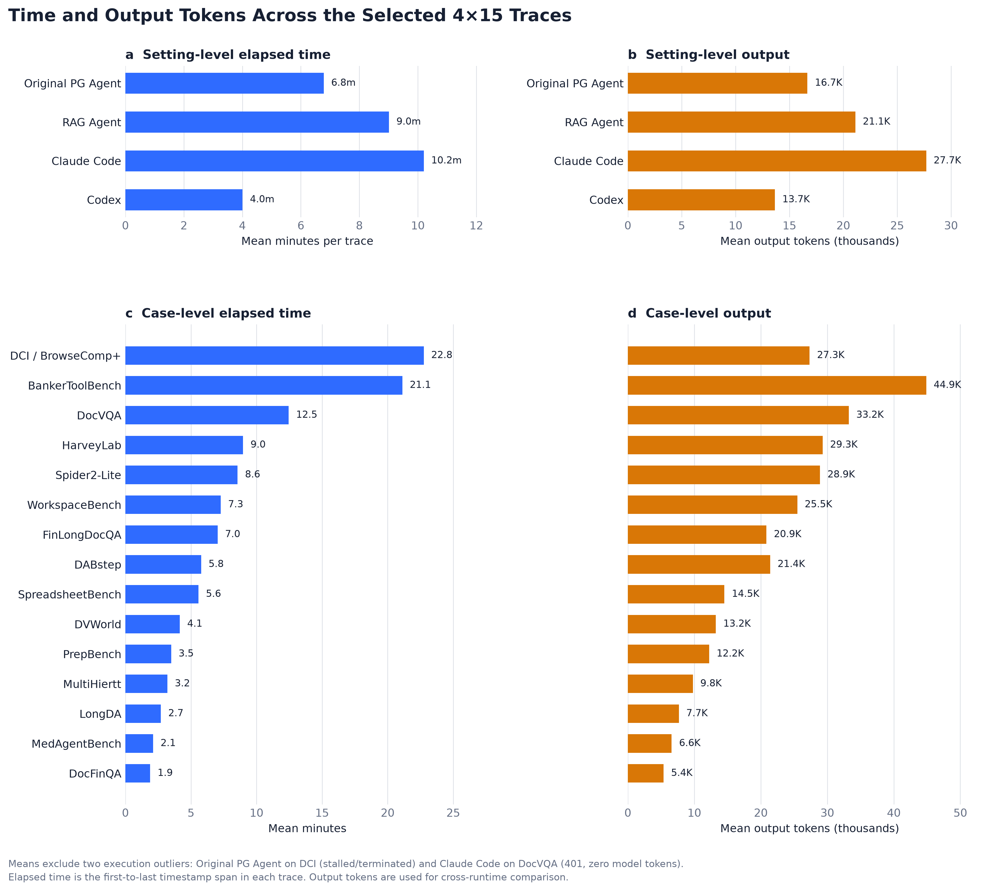

# RAG Bench

本仓库保存 15 个 benchmark case、RAG Agent 的 `AGENTS.md`，以及 Original PG Agent、
RAG Agent、Claude Code 和 Codex 的 60 条 trace。

## 内容

- `cases/<case>/task.md`：任务描述。
- `cases/<case>/data/`：任务数据。
- `agent-configs/rag-agent/AGENTS.md`：RAG Agent 指令。
- `agent-configs/original-pg-agent/AGENTS.md`：Original PG Agent 使用的近空指令。
- `traces/<agent>/<case>.jsonl`：四组结果各 15 条 trace。
- `figures/agent_results.png`：总体通过数和逐 case 结果图。
- `results/trace_metrics.csv`：60 条 trace 的逐条时间和 token 明细。
- `results/case_summary.csv`：剔除执行异常后的逐 case 稳健汇总。
- `figures/trace_efficiency.png`：四个 setting 和 15 个 case 的耗时、输出 token 图。
- `RESULTS_ANALYSIS.md`：RAG Agent 的主要改进和剩余失败分析。

## Results

| Agent | PASS | 说明 |
| --- | ---: | --- |
| Original PG Agent | 5/15 | 使用只有标题的近空 `AGENTS.md` |
| RAG Agent | 10/15 | 使用本仓库 `agent-configs/rag-agent/AGENTS.md` |
| Claude Code | 10/15 | 15 个 case 各选一条 trace |
| Codex | 7/15 | 15 个 case 各选一条 trace |

Original PG Agent 的 15 条 trace 位于 `traces/original-pg-agent/`，全部对应仓库当前的
`task.md`。最新补跑的 5 个 case 中，LongDA 和 MultiHiertt 通过。15 个 case 均有可解析
trace；更具体的结果见该目录下的 `README.md`。

## Time and tokens

时间按每条 trace 第一条到最后一条事件计算；跨 runtime 的 token 对比使用输出 token。
图中的平均数剔除了 Original PG Agent 的 DCI 长时间停滞终止，以及 Claude Code 的
DocVQA 401/零 token 运行；CSV 同时保留 clean mean 和中位数。60 条逐 trace 明细、
15 个 case 汇总和 4 个 setting 汇总见
[`results/`](results/README.md)。

完整简要分析见 [`RESULTS_ANALYSIS.md`](RESULTS_ANALYSIS.md)。

## Cases

1. `spider2lite_f1_overtake_audit_hard`
2. `dci_browsecomp_architecture_firm_hard`
3. `docfinqa_oilgas_canada_pdf_hard`
4. `docvqa_contract_effective_date_ocr_hard`
5. `longda_nscg_telework_hard`
6. `multihiertt_global_products_atoi_share_hard`
7. `workspacebench_taobao_permissions_hard`
8. `dvworld_dvevol_crime_association_network_hard`
9. `bankertoolbench_cake_lbo_sensitivity_hard`
10. `finlongdocqa_interest_expense_sensitivity_screen_hard`
11. `dabstep_real_fees_1681`
12. `prepbench_loyalty_tier_normalization_hard`
13. `spreadsheetbench_working_paper_transpose_hard`
14. `harveylab_reps_diligence_discrepancy_hard`
15. `medagentbench_potassium_repletion_order_hard`

DCI/BrowseComp-Plus 的明文任务和语料受上游发布限制，因此该 case 只保留说明，
不上传受限内容。第三方数据权利说明见 `THIRD_PARTY_NOTICES.md`。
